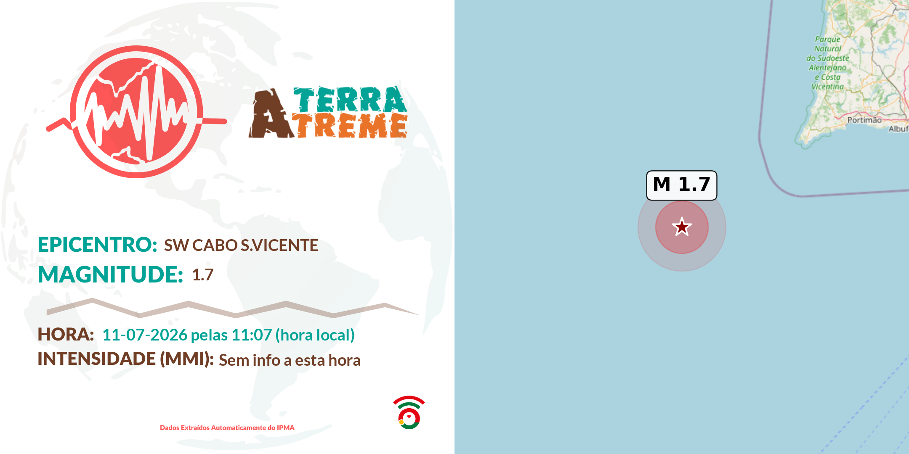

# ATerraTreme

**Real-time seismic monitoring for mainland Portugal, Madeira, and the Azores.**



A tool that consumes the official [IPMA](https://www.ipma.pt) APIs, displays earthquakes on an interactive map, and automatically generates alert images ready to publish (Discord / social media).

Used by [VOST Portugal](https://vost.pt) under the **#ATerraTreme** hashtag for public earthquake alerts.

---

## Features

- **Interactive map** (Leaflet) with recent earthquakes, emphasis on the latest ones, and heatmap
- **JSON API** (`/api/sismos`) with unified data for Mainland/Madeira and the Azores
- **Automatic alert image generation** (template + map centered on the epicenter)
- **Discord notifications** via webhook when a new earthquake is detected
- **Healthcheck** (`/health`) for orchestrators (Coolify, Docker, etc.)
- **Ready-to-deploy** with Docker / docker-compose

---

## Stack

| Layer           | Technology                                      |
|-----------------|-------------------------------------------------|
| Backend         | Python 3.12 + Flask                             |
| Data            | IPMA Open Data (seismic JSON)                   |
| Maps / images   | GeoPandas, Matplotlib, Contextily, Pillow       |
| Frontend        | Leaflet, Bootstrap Icons, custom CSS            |
| Deploy          | Docker + Coolify-friendly                       |

---

## Requirements

- Python ≥ 3.11 (3.12 recommended)
- System dependencies for GeoPandas/GDAL (already included in the Docker image)
- (Optional) Discord webhook

---

## Local installation

```bash
git clone https://github.com/vostpt/ATerraTreme.git
cd ATerraTreme

python -m venv .venv
source .venv/bin/activate          # Windows: .venv\Scripts\activate

pip install -r requirements.txt

cp .env.example .env
# Edit .env and set the webhook (optional)
```

Start:

```bash
python app.py
```

By default the application listens on `http://0.0.0.0:80` (or the value of `PORT`).

---

## Environment variables

| Variable               | Required | Description                                      |
|------------------------|----------|--------------------------------------------------|
| `DISCORD_WEBHOOK_URL`  | No       | Discord webhook URL for earthquake alerts        |
| `PORT`                 | No       | HTTP port (default `80`)                         |

Example (`.env`):

```env
DISCORD_WEBHOOK_URL=https://discord.com/api/webhooks/...
PORT=80
```

---

## Docker

### Build & run

```bash
docker compose up -d --build
```

The application is available on the port defined by `PORT` (exposed internally as 80).  
For local access, uncomment the `ports` section in `docker-compose.yml`:

```yaml
ports:
  - "9076:80"
```

### Healthcheck

The container includes a healthcheck that hits `/health`.

---

## Endpoints

| Method | Path                     | Description                                      |
|--------|--------------------------|--------------------------------------------------|
| `GET`  | `/`                      | Web interface (earthquake map)                   |
| `GET`  | `/api/sismos`            | JSON with recent earthquakes (IPMA)              |
| `GET`  | `/assets/SISMO_TWEET.png`| Latest generated alert image                     |
| `GET`  | `/health`                | Healthcheck (status 200 if the app is alive)     |

---

## How the monitor works

1. Every ~45 s the service queries the official IPMA APIs:
   - Mainland + Madeira: `https://api.ipma.pt/open-data/observation/seismic/7.json`
   - Azores: `https://api.ipma.pt/open-data/observation/seismic/3.json`
2. Already processed earthquakes are kept in memory (max. 5000, FIFO).
3. For each new earthquake:
   - Generates a map centered on the epicenter
   - Composes the final image with the alert template
   - Sends the image + message to Discord (if the webhook is configured)

---

## Repository structure

```
ATerraTreme/
├── app.py                 # Flask + earthquake monitor + image generation
├── assets/
│   ├── SISMO_TEMPLATE_AUTO.png
│   ├── Lato-Bold.ttf
│   └── ...
├── static/                # CSS + JS (Leaflet, heatmap)
├── templates/
│   └── index.html
├── Dockerfile
├── docker-compose.yml
├── requirements.txt
├── .env.example
└── README.md
```

---

## License

This project is licensed under the MIT License — see the LICENSE file for details.

---

## Credits

Seismic data: **Instituto Português do Mar e da Atmosfera (IPMA)**  
Original project: [pedrolucas7i/SISMOS](https://github.com/pedrolucas7i/SISMOS)  
Maintained by **[VOST Portugal](https://vost.pt)** ([@VOSTPT](https://x.com/VOSTPT))

#### **Made with ❤️ by Pedro Lucas**